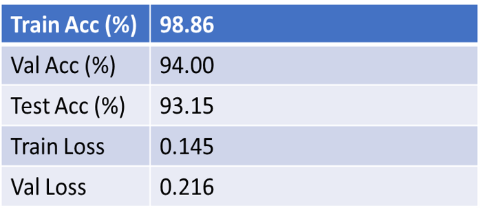
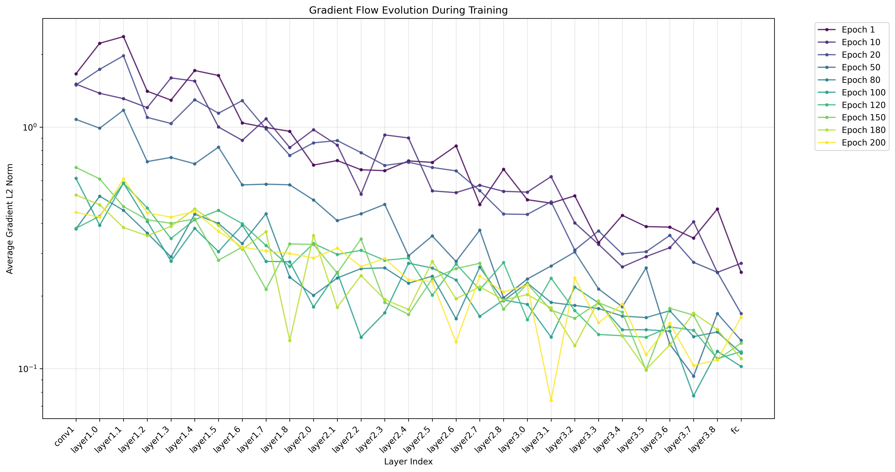
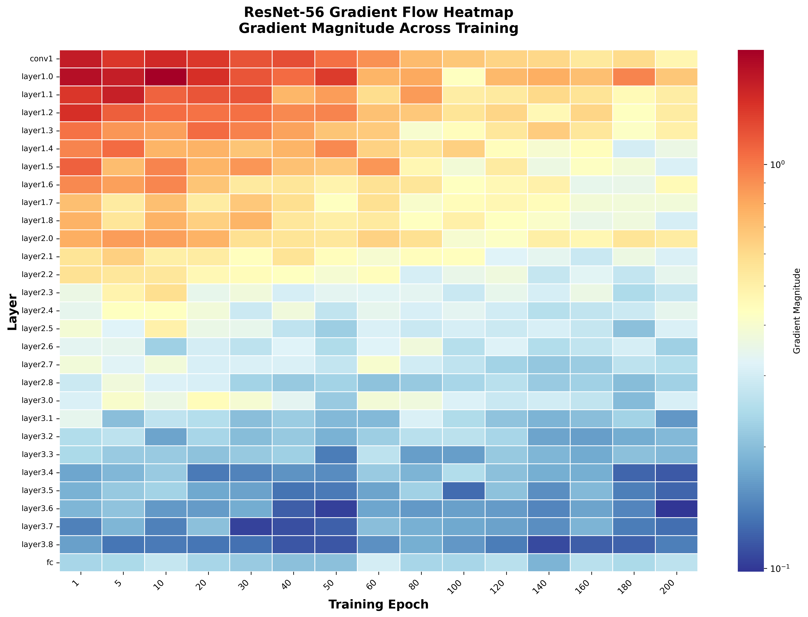

# ResNet-56 Implementation on CIFAR-10

This project implements the 56-layer Residual Network (ResNet-56) for CIFAR-10 entirely from scratch. The focus is on demonstrating the successful stabilization of gradient flow via the core Residual Block structure

- Training script: [src/train_resnet56_cifar10.py](src/train_resnet56_cifar10.py)
- Requirements: [requirements.txt](requirements.txt)
- Background notes: [docs/ResNet.pdf](docs/ResNet.pdf)


## Overview

Residual Networks enable very deep models by learning residual functions with identity shortcuts, stabilizing gradient propagation. This repo reproduces a CIFAR-style ResNet-56 (depth = 6n+2 with n=9) and provides visual diagnostics for gradient flow and training outcomes.

## Repository structure

```
.
├─ analysis/
│  ├─ ResNet description.png
│  ├─ Result.png
│  ├─ gradient_flow.png
│  └─ gradient_heatmap_.png
├─ docs/
│  └─ ResNet.pdf
├─ src/
│  └─ train_resnet56_cifar10.py
├─ .gitignore
├─ README.md
└─ requirements.txt
```

## Training

Example (tune to your environment):
```
python src/train_resnet56_cifar10.py \
  --epochs 200 \
  --batch-size 128 \
  --lr 0.1 \
  --device cuda
```

To resume:
```
python src/train_resnet56_cifar10.py --resume <path_to_checkpoint>
```

## Evaluation

If evaluation-only or test flags are supported, invoke via the script’s CLI (see `--help`). Otherwise, load a checkpoint and run a validation pass as implemented in the training script.

---

## Analysis and results

Below are key visuals from the `analysis/` folder to highlight architecture, outcomes, and gradient behavior.

### 1) ResNet-56 (CIFAR) architecture sketch


- Three stages operating on 32×32 feature maps (with downsampling between stages)
- BasicBlock residual units with identity/projection shortcuts
- Depth 56 via 6n+2 layers (n=9)

### 2) Training/validation outcomes


- Typical training curves (loss/accuracy) demonstrating steady optimization
- Final test accuracy may vary with schedule, augmentation, and seed

### 3) Gradient flow across layers


- Per-layer gradient magnitudes remain well-behaved in deep stacks due to residual connections
- Useful to detect vanishing/exploding gradients or dead blocks

### 4) Gradient magnitude heatmap


- Heatmap perspective of gradients across depth/steps
- Helps verify stable propagation and identify anomalous layers

---

## Implementation notes

- Architecture: CIFAR-style ResNet-56 with BasicBlocks and identity/projection shortcuts
- Normalization/activation: BatchNorm + ReLU as in the original paper
- Reference: He et al., “Deep Residual Learning for Image Recognition” (CVPR 2016), see [docs/ResNet.pdf](docs/ResNet.pdf)
